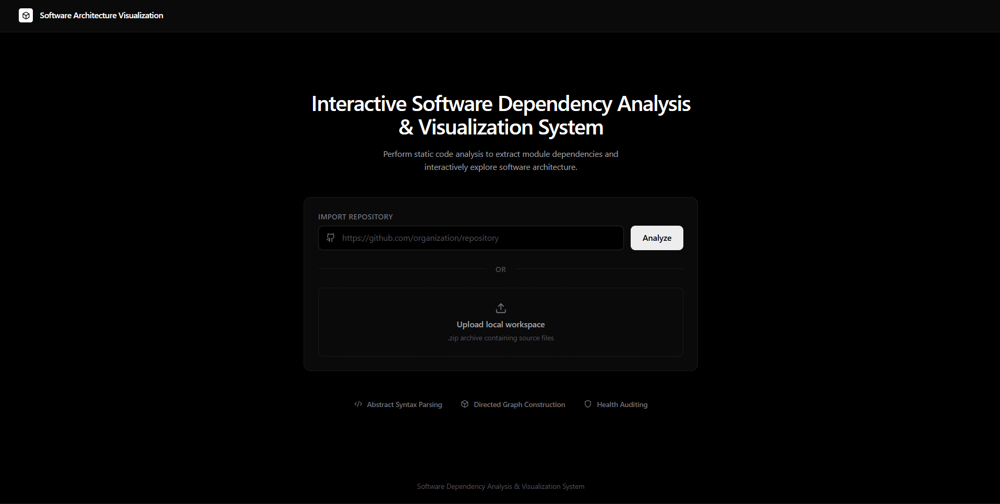
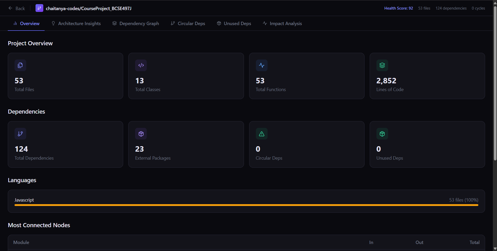
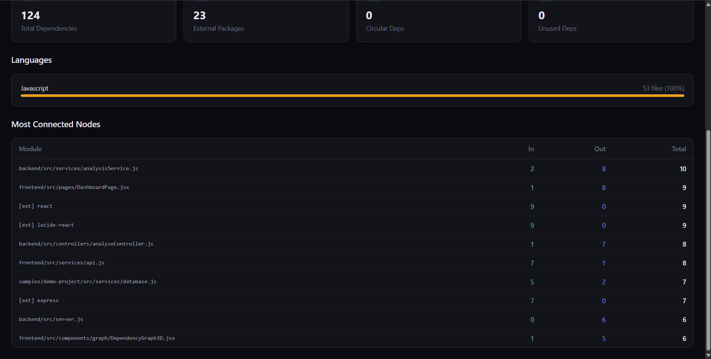
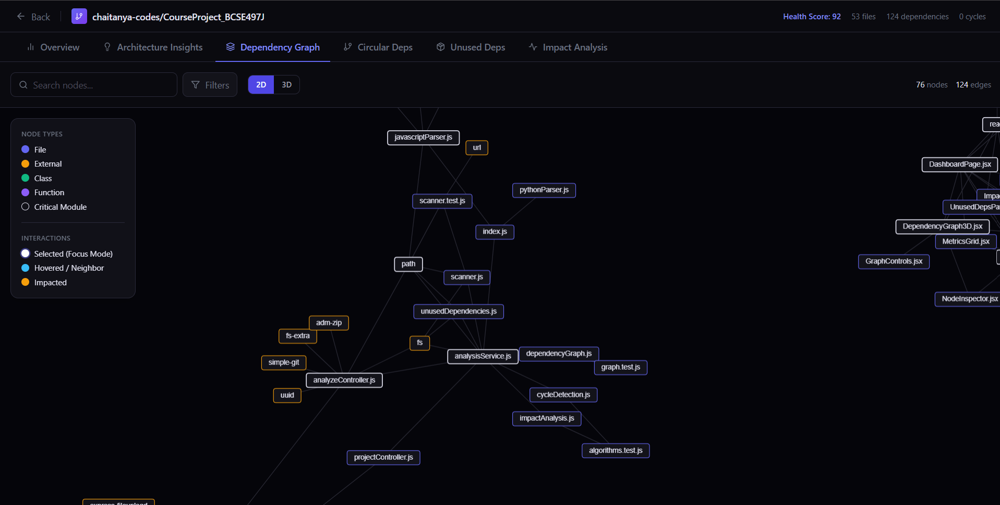
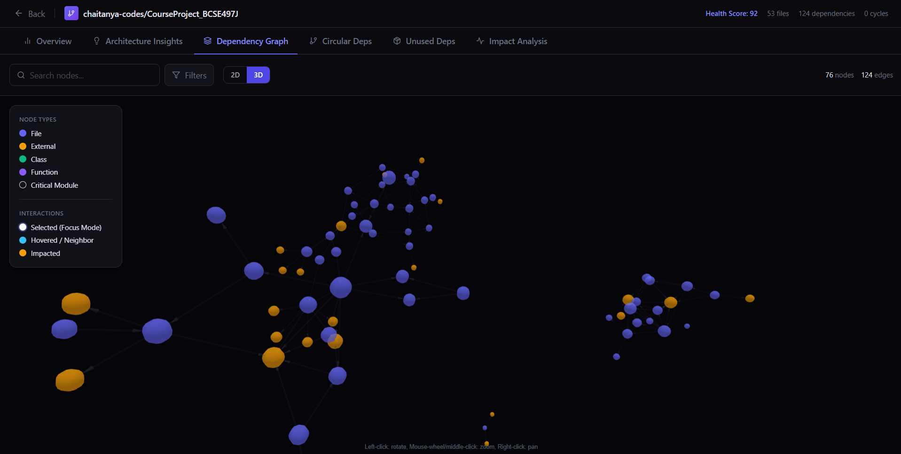
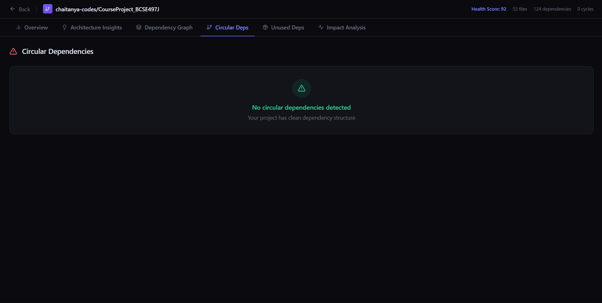
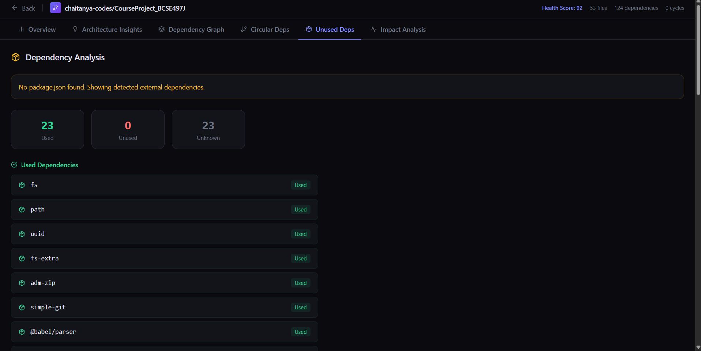
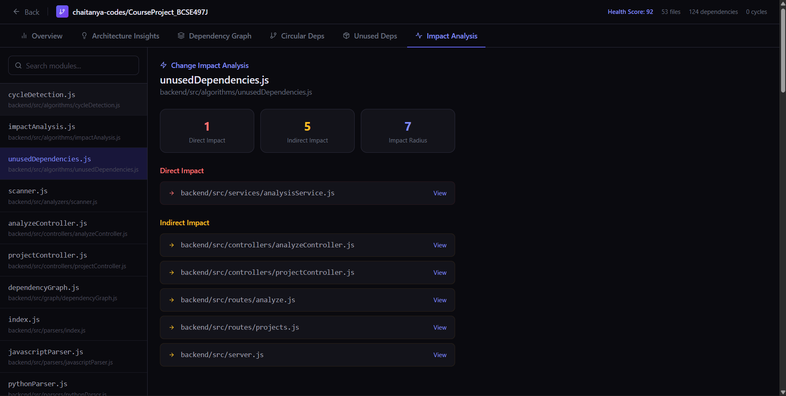
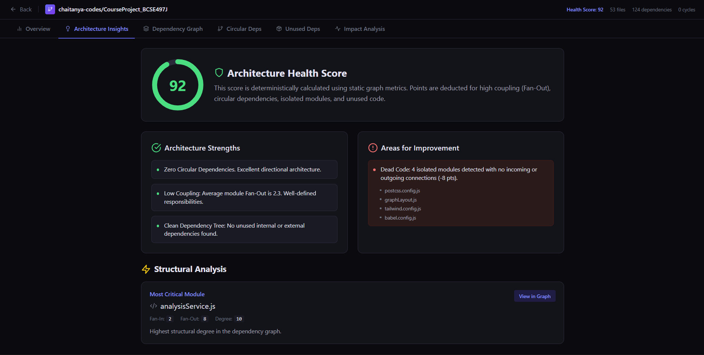

# Interactive Software Dependency Analysis & Visualization System

> An interactive software architecture analysis platform that performs static code analysis, extracts software dependencies, constructs dependency graphs, and provides actionable architectural insights through interactive visualizations.


---

- [Overview](#overview)
- [Why this Project](#why-this-project)
- [Key Features](#key-features)
- [System Workflow](#system-workflow)
- [System Architecture](#system-architecture)
- [Algorithms Used](#algorithms-used)
- [Architecture Health Score](#architecture-health-score)
- [Technology Stack](#technology-stack)
- [Project Structure](#project-structure)
- [Installation](#installation)
- [Running the Application](#running-the-application)
- [Using the Application](#using-the-application)
- [Screenshots](#screenshots)
- [Validation & Testing](#validation--testing)
- [Current Limitations](#current-limitations)
- [Future Enhancements](#future-enhancements)
- [Acknowledgements](#acknowledgements)
- [Contributors](#contributors)
- [License](#license)

# Overview

Modern software systems often consist of hundreds or thousands of interconnected files, making it difficult for developers to understand dependencies, estimate the impact of code changes, and identify architectural issues.

The **Software Dependency Analysis & Visualization System** addresses this challenge by automatically analyzing source code from a GitHub repository or uploaded ZIP archive. It extracts dependency relationships using static code analysis, constructs a dependency graph, and presents the architecture through interactive **2D and 3D visualizations** alongside deterministic architectural insights.

The platform enables developers to:

- Understand software architecture
- Visualize module dependencies
- Detect circular dependencies
- Analyze change impact
- Identify unused dependencies
- Discover highly coupled modules
- Measure architectural health

---

# Live Demo

> **Coming Soon**

🌐 Application: *(Will be added after deployment)*

📂 GitHub Repository: *(Repository link will be added after publishing)*

---

# Why this Project?

Understanding medium and large software systems is often challenging because dependencies are spread across hundreds of interconnected files.

This project automates dependency extraction using static code analysis and transforms the resulting relationships into interactive visualizations and architectural insights. Instead of manually tracing imports across the codebase, developers can quickly understand software structure, estimate the impact of modifications, identify design issues, and improve maintainability.

The project combines concepts from:

- Static Code Analysis
- Compiler Design
- Graph Theory
- Software Architecture
- Software Engineering

into a practical developer tool.

---

# Key Features

## Repository Analysis

- Analyze public GitHub repositories
- Analyze uploaded ZIP archives
- Automatic recursive source code scanning
- Multi-language project support

---

## Static Code Analysis

### JavaScript / TypeScript

- AST-based parsing using Babel
- Import extraction
- Export extraction
- Class detection
- Function detection
- Relative dependency resolution
- Path alias support (`@/`, `~/`, `tsconfig`, `jsconfig`)

### Python

- Import relationship extraction
- Module dependency analysis

---

## Interactive Dependency Graph

### 2D Graph

- Interactive force-directed visualization
- Rectangle-based node rendering
- Dynamic labels
- Search highlighting
- Dependency highlighting
- Focus mode
- Zoom & Pan
- Node dragging
- Hover interactions

### 3D Graph

- Interactive WebGL visualization
- Rotate
- Zoom
- Pan
- Node selection
- Impact visualization

---

## Dependency Analysis

### Circular Dependency Detection

Uses **Tarjan's Strongly Connected Components (SCC)** algorithm to detect cyclic dependencies.

### Change Impact Analysis

Uses **Breadth First Search (BFS)** to determine direct and indirect dependencies affected by modifying a selected module.

### Unused Dependency Detection

Compares imported packages against `package.json` to identify unused dependencies.

### Dead Code Detection

Automatically detects isolated modules where:

- Fan-In = 0
- Fan-Out = 0

---

## Rule-Based Architecture Insights

Automatically computes:

- Architecture Health Score
- Fan-In
- Fan-Out
- Degree Centrality
- Most Critical Module
- High Coupling Detection
- Refactoring Candidates
- Structural Bottlenecks
- Dead Code
- Project Strengths
- Project Weaknesses

---

# Key Highlights

- Static code analysis using Abstract Syntax Trees (AST)
- Interactive 2D and 3D dependency graph visualization
- Deterministic architecture health scoring
- Graph-theoretic analysis using Tarjan's SCC and BFS
- Rule-based architecture insights
- GitHub repository and ZIP archive analysis
- Modern React dashboard with interactive exploration

---

# System Workflow

```text
                GitHub Repository
                        │
                        │
                ZIP Upload Support
                        │
                        ▼
              Repository Scanner
                        │
                        ▼
             Static Code Analysis
        (JavaScript AST / Python)
                        │
                        ▼
          Dependency Graph Builder
                        │
                        ▼
          Graph Analysis Algorithms
                        │
        ┌───────────────┼───────────────┐
        ▼               ▼               ▼
 Circular      Impact Analysis    Unused Dependencies
Dependencies
        │               │               │
        └───────────────┼───────────────┘
                        ▼
          Architecture Insights Engine
                        │
                        ▼
      Interactive Dashboard (React)
```

---

# System Architecture

```text
Frontend (React + Vite)

        │

REST API (Express)

        │

Analysis Service

        │

Repository Scanner

        │

Language Parsers

        │

Dependency Graph

        │

Graph Algorithms

        │

Architecture Insights Engine

        │

JSON Response

        │

Interactive Dashboard
```

---

# Algorithms Used

## 1. Abstract Syntax Tree (AST) Parsing

JavaScript and TypeScript files are parsed using **@babel/parser** and **@babel/traverse** to accurately extract:

- Imports
- Exports
- Classes
- Functions

AST parsing provides significantly higher accuracy than traditional regular expression-based parsing.

---

## 2. Tarjan's Strongly Connected Components (SCC)

Used for Circular Dependency Detection.

### Time Complexity

```
O(V + E)
```

Where:

- **V** = Number of Nodes
- **E** = Number of Edges

---

## 3. Breadth First Search (BFS)

Used for Change Impact Analysis.

Starting from a selected module, BFS traverses all reachable dependent modules to determine the propagation of changes.

### Time Complexity

```
O(V + E)
```

---

## 4. Degree Analysis

Used to compute:

- Fan-In
- Fan-Out
- Degree Centrality

```
Degree = Fan-In + Fan-Out
```

---

# Architecture Health Score

The system computes a deterministic **Architecture Health Score (0–100)**.

Evaluation considers:

| Metric | Purpose |
|----------|----------|
| Circular Dependencies | Detect cyclic architecture |
| High Coupling | Identify highly dependent modules |
| Unused Dependencies | Detect unnecessary packages |
| Dead Code | Detect isolated modules |
| Average Fan-Out | Evaluate modularity |

The scoring model is entirely deterministic and does **not** rely on AI.

---

# Technology Stack

## Frontend

- React
- Vite
- Tailwind CSS
- React Force Graph 2D
- React Force Graph 3D
- Lucide React

---

## Backend

- Node.js
- Express.js
- @babel/parser
- @babel/traverse
- Simple Git
- Adm-Zip

---

## Graph Algorithms

- Tarjan SCC
- Breadth First Search
- Degree Centrality
- Graph Traversal

---

## Development Tools

- Git
- GitHub
- VS Code
- ESLint
- npm

---

# Project Structure

```text
backend
│
├── src
│   ├── algorithms
│   ├── analyzers
│   ├── controllers
│   ├── graph
│   ├── parsers
│   ├── routes
│   ├── services
│   └── server.js
│
frontend
│
├── src
│   ├── components
│   ├── pages
│   ├── services
│   └── App.jsx
│
tests
│
docs
│
README.md
```

---

# Installation

## Clone Repository

```bash
git clone https://github.com/<username>/<repository>.git
```

---

## Backend Setup

```bash
cd backend

npm install

npm run dev
```

---

## Frontend Setup

```bash
cd frontend

npm install

npm run dev
```

---

# Running the Application

Backend

```text
http://localhost:3000
```

Frontend

```text
http://localhost:5173
```

---

# Using the Application

1. Start the backend server.
2. Start the frontend server.
3. Enter a public GitHub repository URL or upload a ZIP archive.
4. Wait for the analysis to complete.
5. Explore:
   - Overview
   - Dependency Graph (2D / 3D)
   - Circular Dependencies
   - Impact Analysis
   - Architecture Insights

---

# Screenshots

## Landing Page



---

## Dashboard





---

## 2D Dependency Graph



---

## 3D Dependency Graph



---

## Circular Dependency Detection



---

---

## Unused Dependency



---

---

## Impact Analysis



---


## Architecture Insights



---

# Validation & Testing

The analysis engine was validated using both real-world repositories and purpose-built controlled test projects with known expected outputs.

| Feature | Status |
|----------|--------|
| Dependency Extraction | ✅ |
| Fan-In Calculation | ✅ |
| Fan-Out Calculation | ✅ |
| Highest Degree Detection | ✅ |
| Circular Dependency Detection | ✅ |
| Dead Code Detection | ✅ |
| Unused Dependency Detection | ✅ |
| Impact Analysis | ✅ |
| Architecture Health Score | ✅ |

Manual validation was performed by comparing computed results against expected outputs on controlled repositories.

---

# Current Limitations

- JavaScript and TypeScript analysis is more comprehensive than Python analysis.
- Very large repositories may require additional visualization optimization.
- Projects are currently stored in memory during execution.
- Report export functionality is not yet available.

---

# Future Enhancements

- Support additional programming languages (Java, C++, Go, Rust)
- Persistent project storage
- Repository version comparison
- Export reports (PDF / JSON)
- Advanced graph clustering
- IDE integration (VS Code Extension)
- CI/CD integration
- Incremental repository analysis
- AI-assisted architecture recommendations
- Repository evolution analysis

---

# Acknowledgements

This project was developed as part of the **Bachelor of Technology (Computer Science & Engineering)** curriculum at **Vellore Institute of Technology**.

The implementation draws upon established concepts in:

- Static Code Analysis
- Compiler Design
- Graph Theory
- Software Architecture
- Software Engineering

---

# Contributors

- **Vasu Ranjan**
- **Aarav Ranjan Roy**
- **Chaitanya Bajaj**

Bachelor of Technology

Computer Science & Engineering

Vellore Institute of Technology

---

# License

This project was developed for academic and educational purposes as part of a Bachelor of Technology final-year course project.

The source code may be used for learning, research, and non-commercial educational purposes.